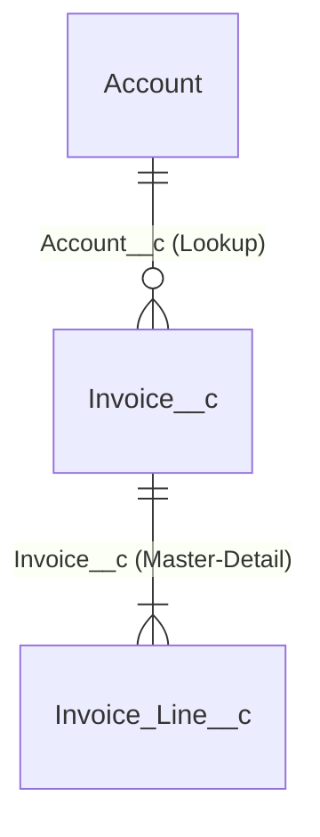

# Salesforce Data Model Patterns

## Standard vs custom

Reuse a standard object when its lifecycle, sharing behaviour, and reporting
match the entity, for example Account and Contact for parties, Opportunity for
pipeline deals, Case for service requests, Product2, Pricebook2, and
PricebookEntry for catalogues, and Asset for installed items. Using a custom
object that duplicates a standard one loses standard features (forecasting,
entitlements, Einstein) and costs licenses: Platform licenses cannot access
some standard objects.

## Relationships

| Need | Use | Notes |
|------|-----|-------|
| Child cannot exist without parent; parent controls sharing; roll-ups needed | Master-detail | Max 2 per object; cascade delete; child inherits sharing |
| Optional or independent relationship | Lookup | Optional cascade (`Restrict`/`Clear`/`Delete`); use DLRS or Apex for roll-ups |
| Many-to-many | Junction object with two master-details | The first master-detail drives look and feel and sharing |
| Self-hierarchy | Hierarchical lookup (User only) or self lookup | |
| External system rows | External object (`__x`) via Salesforce Connect | Not stored; query limits apply |

## Field design

- Every integration-loaded object has an **External ID** (unique) field for
  idempotent upserts.
- Use picklists (restricted, global value sets when shared) instead of free text
  for anything reported on.
- Formula fields cost no storage but cannot be indexed (except deterministic
  ones), and complex formulas can slow list views and reports.
- Use roll-up summaries (master-detail only) for counts and sums, and watch for
  lock contention on busy parents.
- Choose record types when one object needs different picklist values, layouts,
  or processes. Choose a new object when the lifecycle differs.
- Use Custom Metadata Types for deployable configuration (rules, mappings,
  thresholds); use Custom Settings (hierarchy) for per-user or per-profile
  overrides.

## Large data volumes (LDV)

- Make queries selective: filter on indexed fields (Id, Name, OwnerId,
  CreatedDate, SystemModstamp, lookups, External ID and unique fields, and
  custom indexes from Support). A selective filter returns less than about 10%
  of the first million rows (5% after that, capped).
- Avoid leading-wildcard `LIKE`, `!=`, and `NOT IN` on large objects.
- Archive with Big Objects or an off-platform store, and set a retention policy.
- Consider skinny tables (via Support) for wide, heavily queried objects.
- Avoid ownership and account data skew: distribute ownership and avoid giant
  parents.

## ERD notation

Use mermaid `erDiagram` with API names:

